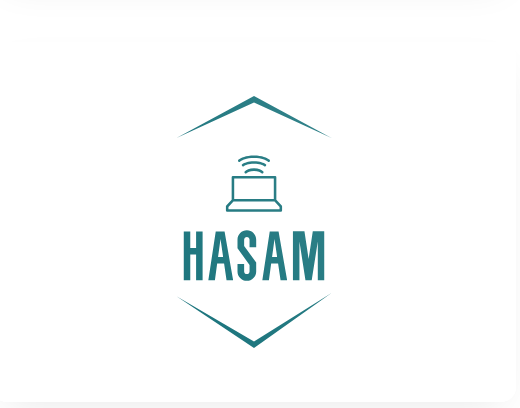

  

<h1 align="center">👋 Hi! I'm Hasamudin</h1>
<h3 align="center">Web Developer & Tech Enthusiast</h3>

---

## 🚀 About Me  
- 👨‍💻 Web developer focused on **HTML, CSS, JavaScript**  
- 🐍 Experience with **Python** and **C++**  
- 🔌 Familiar with **Arduino** and electronics projects  
- 🌱 Constantly learning new tools and technologies  
- 🎯 Goal: Building professional projects & collaborating with international teams  

---

## 🛠 Skills  

  

---

## 📂 Featured Projects  

- 🌐 **Responsive Website Development** using HTML, CSS, JavaScript  
- ✅ **Python & C++ | Intermediate Projects** 🚀 Exploring algorithms, data structures, and problem-solving through hands-on coding.  
- ✅ **Arduino | Advanced Projects** 🔌 Building smart hardware systems, automation setups, and creative prototypes.
- [profile-card project](https://hasamudin.github.io/profile-card/)

---

## 📊 My GitHub Stats  

  
  

---

## 📬 Contact me
  📧 Email: [click here](hasamudinsaydi786@gmail.com)
    
  🔗 

   🔗 

   🔗 
   
   🌐 Website:   

---